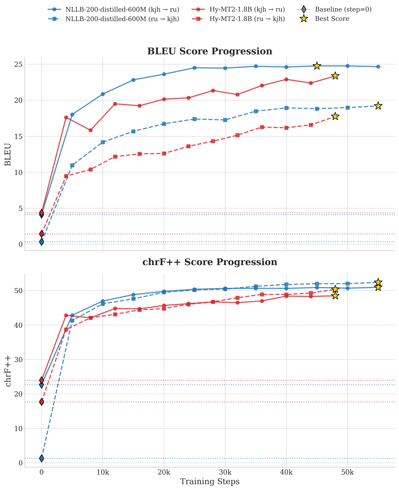

# Khakas-Russian Machine Translation

This repository contains code, datasets information, and models for machine translation between the Khakas and Russian
languages. We provide fine-tuning scripts and resulting models based on the **NLLB-200** and **Hy-MT2** architectures.

## Training Data

Our models were trained on a parallel corpus consisting of approximately **160,000 sentence pairs**. The datasets
include:

- [adeshkin/khakas-russian-parallel-corpus](https://huggingface.co/datasets/adeshkin/khakas-russian-parallel-corpus) (159,213
  pairs)
- [adeshkin/google-smol-en-ru-kjh](https://huggingface.co/datasets/adeshkin/google-smol-en-ru-kjh) (1,688 pairs)

**Data filtering:**
- Minimum text length: ≥ 5 characters
- Maximum sentence length: ≤ 64 words

## Models

We fine-tuned two different architectures for this task. The models are publicly available on Hugging Face:

1. **[adeshkin/nllb-200-distilled-600M-kjh-ru](https://huggingface.co/adeshkin/nllb-200-distilled-600M-kjh-ru)**
    - **Base model:** `facebook/nllb-200-distilled-600M`
    - **Architecture:** Encoder-Decoder (Seq2Seq)
    - **Fine-tuning:** Full fine-tuning after extending the tokenizer and embeddings to fully support Khakas Cyrillic
      characters.

2. **[adeshkin/Hy-MT2-1.8B-kjh-ru-lora](https://huggingface.co/adeshkin/Hy-MT2-1.8B-kjh-ru-lora)**
    - **Base model:** `tencent/Hy-MT2-1.8B`
    - **Architecture:** Decoder-Only (Causal LM)
    - **Fine-tuning:** LoRA (Low-Rank Adaptation) on attention projections (weights merged into the base model).

## Training Hyperparameters

### NLLB-200-distilled-600M

- **Max sequence length**: 128
- **Batch size**: 16 (per device) with 2 gradient accumulation steps
- **Learning rate**: 1e-4
- **Optimizer**: Adafactor
- **LR scheduler**: Cosine with warmup
- **Warmup steps**: 1,000
- **Max steps**: 200,000
- **Precision**: fp16 (autocast)
- **Hardware**: 1x NVIDIA Tesla T4 (8GB VRAM, Google Colab)
- **Training time**: ~10 hours

### Hy-MT2-1.8B (LoRA)

- **LoRA rank**: 64
- **LoRA alpha**: 128
- **LoRA dropout**: 0.05
- **Max sequence length**: 4096
- **Batch size**: 2 (per device) with 16 gradient accumulation steps
- **Learning rate**: 2e-4
- **LR scheduler**: Cosine with minimum LR (1e-5)
- **Warmup ratio**: 0.01
- **Max steps**: 30,000
- **Precision**: bf16
- **Hardware**: 1x NVIDIA RTX 4060 Ti (8GB VRAM)
- **Training time**: ~12 hours

## Evaluation

Both models were evaluated on the **[FLORES+](https://huggingface.co/datasets/openlanguagedata/flores_plus) devtest**
split (1,012 sentence pairs) using [SacreBLEU](https://github.com/mjpost/sacrebleu).

| Model                       | Direction |      BLEU |    chrF++ |
|-----------------------------|-----------|----------:|----------:|
| **NLLB-200-distilled-600M** | kjh → ru  | **24.40** | **50.12** |
|                             | ru → kjh  | **19.09** | **51.10** |
| **Hy-MT2-1.8B (LoRA)**      | kjh → ru  |     21.09 |     46.18 |
|                             | ru → kjh  |     16.82 |     48.86 |

FLORES+ dev split (997 sentences) was used for validation during training. The plot below illustrates the evolution of the validation metrics. Note that the "Training Step" on the x-axis has been scaled so that both models are compared based on having seen the same number of training sentence pairs. The values at step zero represent the baseline zero-shot translation performance of these multilingual models prior to any fine-tuning.



## Quick Start

To reproduce the training process or run inference, follow these steps:

1. Clone the repository:
```bash
git clone https://github.com/adeshkin/khakas-mt.git
cd khakas-mt
```

2. Create a virtual environment and install dependencies:
```bash
python -m venv venv
source venv/bin/activate
pip install -r requirements.txt
```

3. Set up your Hugging Face access tokens (e.g., via `huggingface-cli login` or a `.env` file) to download base models and datasets, and to push the trained models to the Hub.

4. Navigate to the respective model's directory (`nllb-200/` or `hy-mt2/`) and run the data preparation and training scripts.

> **Note for NLLB-200:** Before running `update_tokenizer.py`, ensure you install exactly `transformers==4.57.3`. You can upgrade back to the latest version for the actual training step (`train.py`).

## Repository Structure & Scripts

The repository is organized into folders per model architecture. Each folder contains the necessary scripts for data
preparation, training, evaluation, and inference.

### `nllb-200/`

Scripts for preparing and training the NLLB-200 model:

- `update_tokenizer.py`: Extends the original NLLB tokenizer and embeddings to support missing Khakas characters. *(
  Note: Requires exactly `transformers==4.57.3` due to internal tokenizer modifications)*.
- `train.py`: Script for full fine-tuning.
- `predict.py`: Inference script for translating text.
- `test.py`: Evaluates the trained model on the devtest set.
- `model_push_to_hub.py`: Script to push the fine-tuned model to the Hugging Face Hub.

*The NLLB-200 training code is based on the article: [How to fine-tune an NLLB-200 model for translating a new language](https://cointegrated.medium.com/how-to-fine-tune-a-nllb-200-model-for-translating-a-new-language-a37fc706b865).*

### `hy-mt2/`

Scripts for preparing and training the Hy-MT2 model using LoRA:

- `prepare_data.py`: Prepares the dataset by formatting it into instruction-following chat messages (JSONL).
- `train_dense.py`: Main Python script for training Hy-MT2.
- `train_dense_lora.sh`: Shell script wrapper to launch the LoRA training with optimal hyperparameters.
- `merge_lora_weight.py` & `merge_lora_weight.sh`: Scripts to merge the trained LoRA weights back into the base model
  for faster inference.
- `predict.py`: Inference script for translating text.
- `test.py`: Evaluates the model on the devtest set.
- `model_push_to_hub.py`: Script to push the final model to the Hugging Face Hub.

*The Hy-MT2 training code is based on the official repository: [Tencent-Hunyuan/Hy-MT2/tree/main/train](https://github.com/Tencent-Hunyuan/Hy-MT2/tree/main/train).*


## Language Information

* **ISO 639-3:** `kjh`
* **ISO 15924:** `Cyrl`
* **Glottocode:** `khak1248`

The Khakas language (Хакас тілі) is the ethnic language of the Khakas, the indigenous population of the
Republic of Khakassia located in southern Siberia. It belongs to the Siberian subsubgroup of the Turkic language family.
Khakas is the result of the historical consolidation of dialects. The Kachin and Sagai dialects were chosen as the base
of the Khakas literary language based on the greater number of their native speakers. Until 1917, the scientific and
official literature used the names the language of the Abakan or Minusinsk Tatars, the language of the Abakan or Yenisei
Turks [Донидзе, 1997, p. 459]. The appearance of the name "Khakas tili" (Khakas language) is connected with the adoption
in 1917 at the II Congress of the Khakas people on the initiative of S. D. Maynagashev decided to use the ethnonym "
Khakasy", which is common to all. "The Congress unanimously decided to return to the people their ancient self–name -
Khakasy. The resolutions of the 1918 Uyezd Congress of Soviets confirmed the popular decision" [Кызласов, 1994, p. 8].

N. A. Baskakov attributed the Khakas language to the Eastern Hunnic branch, the Uighur group, within which it, together
with Kamasin, Chulym, Shorsky, Sary-Uighur and the northern dialects of the Altaic language, forms a special Khakas
subgroup [Баскаков, 1975, p. 3].

According to the 2020 All-Russian Population Census, the total number of individuals who identified as ethnically Khakas
in Russia is 61,365. Among them, just over 44% indicated the Khakas language as their mother tongue, which represents a
14% decrease compared to the 2010 census (58%) [Borgoyakova, 2025, p. 46]. This trajectory aligns with the
classification of Khakas as a “Definitely Endangered” language by UNESCO [Moseley, 2010]. Such a transition poses a
significant threat to intergenerational language transfer and complicates the preservation of linguistic heritage.

### References

1. Донидзе Г. И. Хакасский язык //Языки мира. Тюркские языки. – 1997. – С. 459.
2. Кызласов Л. Р., Кызласов И. Л. Ключевые вопросы истории хакасов //Земля Сибирская (Страницы истории и современность):
   сборник статей. Абакан–Москва: Эвтектика. – 1994.
3. Баскаков Н. А. Грамматика хакасского языка. – Nauka, 1975. – №. 1.
4. Borgoyakova T. G., Guseynova A. V. Ethnic and Linguistic Policy and Sociolinguistic Variability of Language Shift (
   Example of Republic of Khakassia) //Humanities and social sciences. – 2025. – №. 3 (122). – С. 44-53.
5. Moseley C. (ed.). Atlas of the World's Languages in Danger. – Unesco, 2010.
